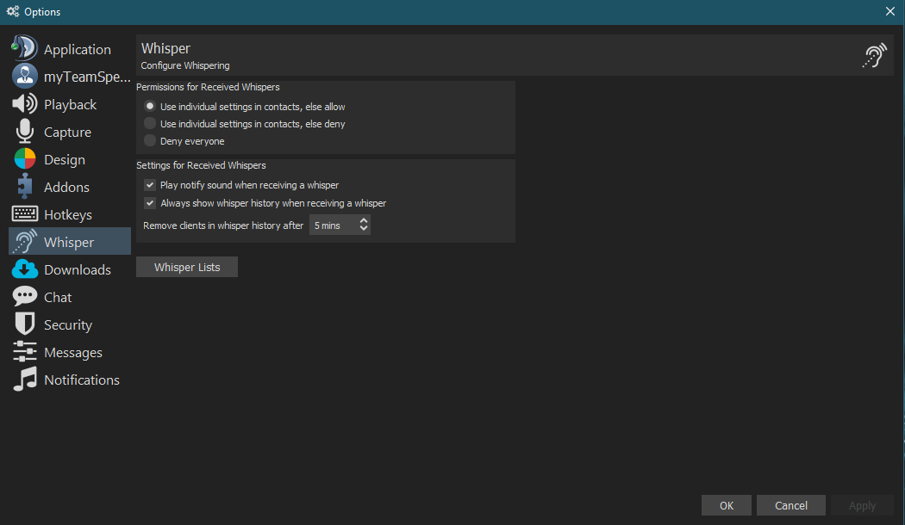
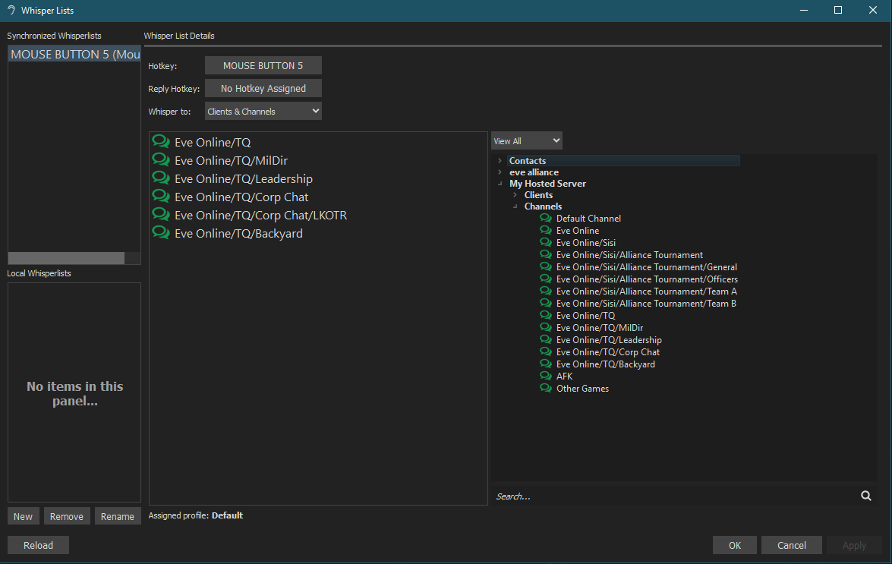

# How to set up whisper lists for Intrepid Crossing ts3 server

So, to share our intel across channels, we are going to be using whisper lists to broadcast across multiple channels. This document shows you how to set that up.

## Instructions

Open teamspeak 3 and connect to the intrepid crossing server, from there hit `ALT-P` to open the options menu, or go to `Tools -> Options`

Once the options window is open, goto `Whisper` in your sidebar

Untick the boxes for `Play notify sound when recieving a whisper` and `Always show whisper history when recieving a whisper`

Click the `Whisper Lists` button, and another dialog should pop up

In this window, assign your new hotkey to broadcast intel across channels using the top button. (Make sure this is different to your main PTT key!)

Change the dropdown for `Whisper to:` to Clients & Channels

Expand the channel tree on the right hand side, and double click each room that begins with `Eve Online/TQ/` , this will ensure that you will be heard by ALL members in those channels.

You can now close down all windows in teamspeak, and sit nice and quietly in a room without listening to political debates! :D WIN

If you have any questions, feel free to get in touch with your corporation CEO!